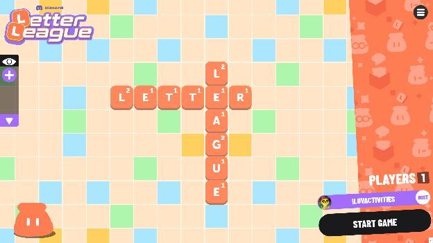

# Letter League — Official FAQ

> Verbatim text from Discord's official Letter League FAQ
> (`info/Letter League FAQ.md`). Images extracted to `images/`.
> Treat this file as the source of truth; the original heavy file in
> `info/` is the raw artifact and should not be edited by hand.

## What is Letter League?

Letter League is an Activity developed at Discord. It's a game where you
and your friends take turns placing letters on a shared game board to
create words in a crossword-style. Spelling words with high earning
letters and placing letters on special spaces earn players more points,
so get your dictionaries and thesauri ready.

## Starting Letter League in Discord

There are many ways to launch Letter League — in a server's voice
channel, in a direct message, or in a group message. See Discord's
[How to Use Apps](https://support-apps.discord.com/hc/en-us/articles/26593412574359)
for instructions.

> Before starting any Discord Activity on the desktop app, turn on
> Hardware Acceleration in **User Settings → Advanced**.

## How to Play Letter League

> These instructions may look slightly different on mobile.
>
> When playing with more than 20 people you may experience technical
> issues. For the best experience, play with up to 6 players.

1. **Adjust settings.** After launching, open the hamburger menu in the
   upper-right and tap the cogwheel to navigate to *Edit Game Settings*.
   You can set the length, scoring mode, and the timer for your game.

   

2. **Pick a scoring mode:**
   - **Wild** *(default)*: When a letter is multiplied it keeps its
     improved score. Letters are colored in to show which multipliers
     have been applied, so the next time someone scores big you can
     reuse those upgraded letters yourself.
   - **Classic**: Letters each have a point value in the lower right.
     When you play a word you score the points of the letters you used.
     Play letters on multiplier squares to score higher.

3. **Build words.** Once the game begins, use the rack near the bottom
   to create words by selecting a tile and then its destination, or by
   dragging it there.

   

   The numbers on each tile represent the points you would score by
   placing that tile in that position. Place letters on multiplier
   squares to increase your word score.

   

4. **Swap or pass.** If a player can't form a valid word, they can
   either swap their tiles by pressing the **Swap** button above the
   rack, or pass their turn with the **Pass Turn** button under the
   timer.

   

5. **Highest score wins** at the end of the game.

   

6. **Need a refresher?** Press the hamburger icon in the top right and
   tap the instructions icon to view the Game Info.

   

## FAQ

**Q: Why is Discord adding games into voice channels?**
A: We started Discord because we are all about bringing people together
around gaming. As Discord has grown, we've seen people use it not only
to play *League*, but also to hang out with friends and play more
casual, social games like *Jackbox* and *Among Us*.

**Q: Is there an age requirement?**
A: There is no age requirement for Letter League.

**Q: How do I play?**
A: To start a game, first join a voice channel. Once there, you should
see the Activity Launcher (the rocket-ship icon) in the voice channel
controls. Click the Activity Launcher to open the Activity Shelf, then
select **Letter League**.

**Q: How many players can play Letter League?**
A: There can be more than 20 players within a game, but you may
experience technical issues. We recommend up to 6 players for the best
experience.

**Q: Where can I report bugs and problems with the game?**
A: Submit a bug report at <https://dis.gd/bugreport>. For instructions
on how bug reports should be submitted, see the Help Center article at
<https://dis.gd/bugs>.

**Q: How do I view/delete my Activities on Discord data? What data is
tracked?**
A: You can view data for Discord-developed Activities like *Letter
League* through the
[Discord Privacy and Safety settings](https://support.discord.com/hc/articles/360004027692).
To enhance gameplay, Letter League accesses and temporarily stores the
following user data once a user joins the Activity:

- Discord ID
- Avatar
- Username

User data is stored as long as the Activity remains active, even if the
user leaves. Once all users leave the Activity and it is determined to
have ended, the user data is deleted and no longer retained by Letter
League.

**Q: Didn't Letter League used to have a different name?**
A: Letter League used to be listed as *Letter Tile*. As part of regular
updates to Discord Activities, we gave Letter League a glow-up and the
name change was part of that effort.

**Q: My question isn't listed, what do I do?**
A: If all is lost, please submit a ticket to support at
<https://dis.gd/contact>.
