# Letter League — Official Rules

> **Canonical source** for game rules, scoring, and board layout used by this
> project. Both humans and AI agents working on this codebase must treat this
> document as the source of truth for game behavior. Engine logic, vision
> validation, and bot decision-making must agree with the rules below.
>
> The text and images here were extracted verbatim from Discord's official
> Letter League help materials (`info/Letter League Info.md`,
> `info/Letter League FAQ.md`).

## Board

Letter League is played on a **19 row × 27 column** grid. The center square
(the star) is where the first word must be played. Premium squares (`2L`,
`3L`, `2W`, `3W`) are scattered symmetrically across the board.

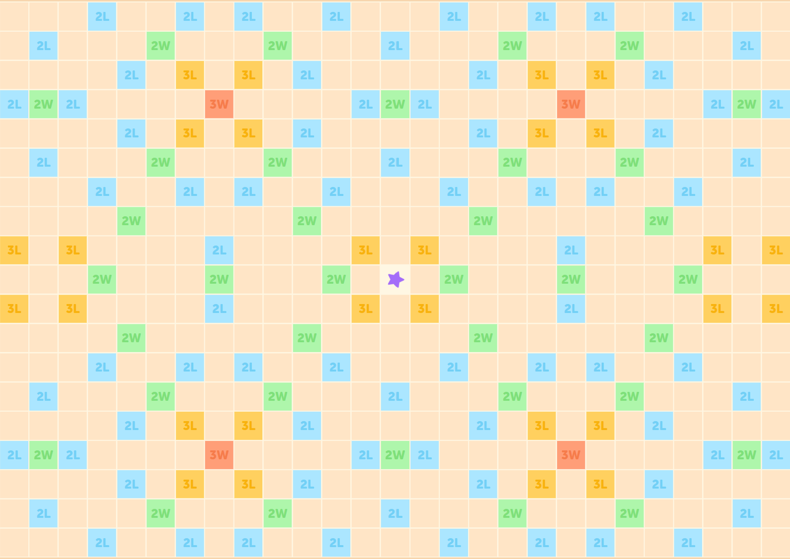

## Game Info — Controls & Basics

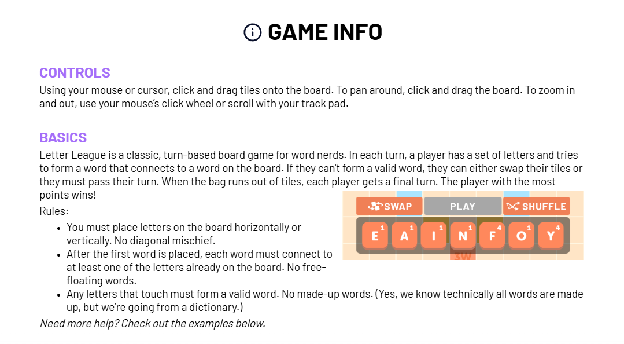

**Controls:** Click and drag tiles onto the board. Click and drag the board
itself to pan. Use the mouse wheel / trackpad scroll to zoom.

**Basics:** Letter League is a classic, turn-based board game for word nerds.
On each turn, a player has a set of letters and tries to form a word that
connects to a word on the board. If they can't form a valid word, they can
swap their tiles or pass their turn. When the bag runs out of tiles, each
player gets a final turn. The player with the most points wins.

### Core rules

1. Letters must be placed **horizontally or vertically**. No diagonals.
2. After the first word is placed, **every new word must connect** to at
   least one letter already on the board. No free-floating words.
3. **Every cross-formed word must be valid.** No made-up words. (Yes — all
   words technically are made up, but we're going from a dictionary.)

## Scoring

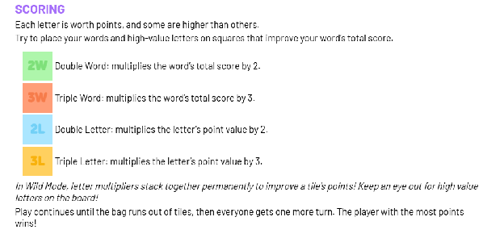

Each letter is worth points; some are higher than others. To maximize score,
place high-value letters and the words you build on premium squares.

| Square | Effect                                                      |
|--------|-------------------------------------------------------------|
| `2W`   | **Double Word** — multiplies the word's total score by 2.   |
| `3W`   | **Triple Word** — multiplies the word's total score by 3.   |
| `2L`   | **Double Letter** — multiplies that letter's value by 2.    |
| `3L`   | **Triple Letter** — multiplies that letter's value by 3.    |

**Wild mode (default):** When a letter is multiplied, it keeps its improved
score *permanently*. Multiplied tiles are colored to mark them, so future
plays can reuse those upgraded letters.

**Classic mode:** Letters carry their printed point values. A word's score
is just the sum of its letters with multipliers applied for that turn only.

Play continues until the bag runs out of tiles, then everyone gets one more
turn. The player with the most points wins.

## Examples

### Example 1 — Forming a new word that crosses an existing word

The word on the board is **TENT**. A player adds **S, A, L** to form
**SEAL**, a valid word worth 7 points.

### Example 2 — Why connecting matters (invalid play)

The words on the board are **TENT** and **TAP**. The player tries to form
**SEAL**, but the side-effect words **AA** and **PL** are not valid, so the
play is rejected.

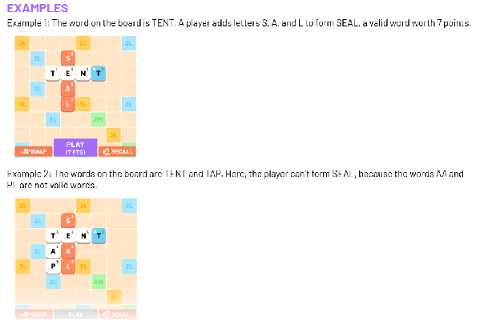

### Example 3 — Advanced: extending and stacking in one move

The word on the board is **BET**. The player adds **S** to make **BETS**,
then adds **W, E, E, T** to spell **SWEET** — all in one move. By extending
a word, the player collects the points from the letters in the original
word **BET**, plus the new word **SWEET**.

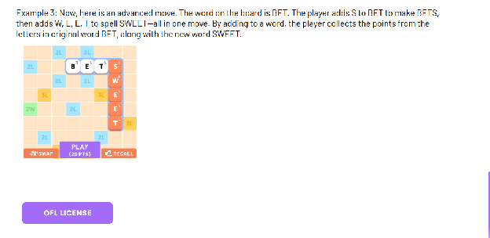

## How a Turn Works (Discord client)

The screenshots below come from Discord's published walkthrough.

### Game settings

After launching the game, open the hamburger menu in the upper-right and
the cogwheel to **Edit Game Settings**. You can configure length, scoring
mode (Wild vs Classic), and timer.

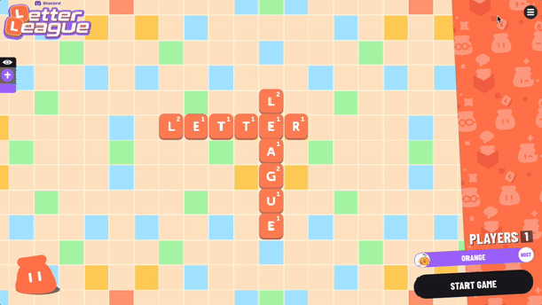

### Tile placement

Use the rack near the bottom to build words. Tap a tile and then its
destination, or drag it directly. The number on each tile is the points
that tile would score in its current position.

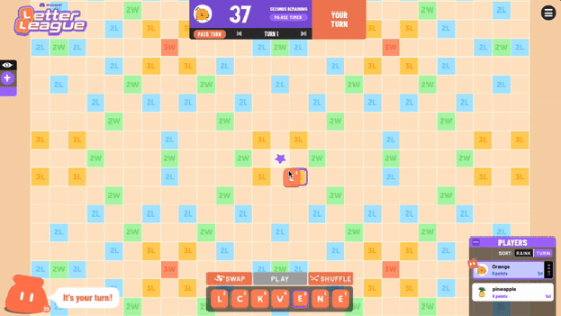

### Multiplier squares

Place letters on premium squares to increase your score.

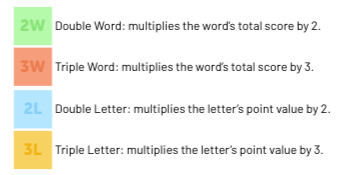

### Swap or pass

If you can't form a valid word, press **Swap** above the rack to exchange
tiles, or **Pass Turn** under the timer.

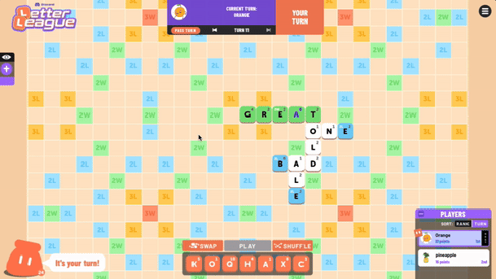

### End of game

Bag empty → each player gets a final turn → highest score wins.

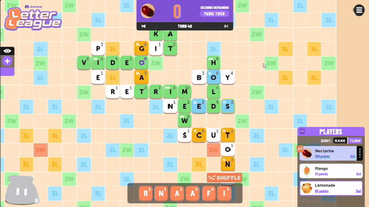

### In-game help

Hamburger menu → instructions icon opens the Game Info panel.

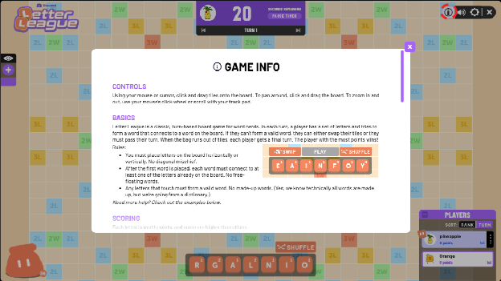

## Quick Reference for Implementers

When building or fixing engine logic, vision parsing, or autoplay, these
invariants must hold:

- **Board dimensions:** 19 rows × 27 columns. Anchor cell is the center
  star square (currently encoded in `src/engine/board.py`).
- **Placement axis:** strictly horizontal or vertical.
- **Connectivity:** after the first move, every play must touch at least
  one existing tile.
- **Validity:** the main word **and every cross-word** formed by the play
  must be in the dictionary.
- **Multipliers:** `2L`/`3L` apply to the letter only; `2W`/`3W` apply to
  the resulting word's total. In Wild mode multiplier effects on a tile
  persist for future turns; in Classic they do not.
- **End condition:** bag empty → one final turn for each remaining player
  → highest cumulative score wins.

If a code change conflicts with anything above, the rules win. Update the
code (and add a test reproducing the rule) rather than weakening this doc.
